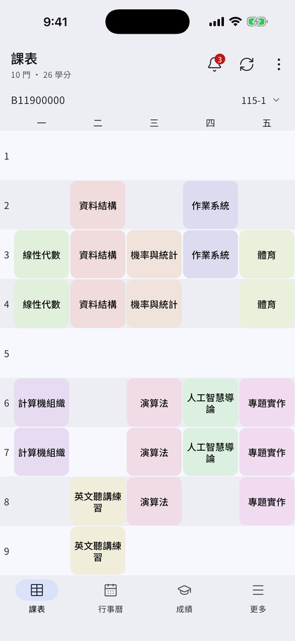
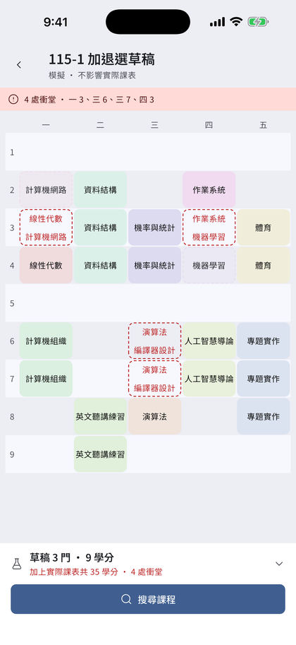
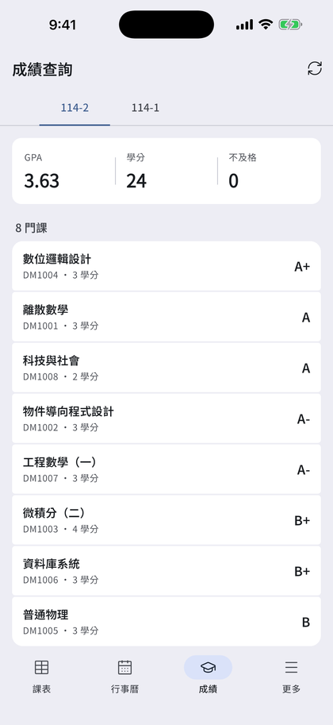

<p align="center">
  
  <h3 align="center">臺灣科技大學TAT App</h3>
  <p align="center">
    <b>專為臺灣科技大學學生設計的校務App</b><br>
    <b>Moodle、學期課表、成績查詢、在學證明等等</b><br>
    <b>一App在手 各種服務應有盡有</b>
    <br>
  </p>
</p>

## 應用程式截圖
|  |  |  |  |
|:-----------------------------------------:|:--------------------------------------------:|:----------------------------------------:|:-----------------------------------:|
| 課表 | 模擬排課 | 行事曆 | 成績 |

--------------------------------
## 安裝指南
### Android裝置
請至Google Play商店下載:

<a href='https://play.google.com/store/apps/details?id=club.ntust.tat'>
  
</a>

### iOS/iPadOS裝置
請至App Store商店下載:

<a href='https://apps.apple.com/tw/app/%E5%8F%B0%E7%A7%91%E5%A4%A7-tat/id6479219269'>
  
</a>
<br><br>

--------------------------------
## 聯絡我們
- [seielika064@icloud.com](mailto:seielika064@icloud.com)
  

--------------------------------
## 開發

### 環境
Flutter SDK 版本鎖定在 `.fvmrc`（目前 3.38.5）。可用 [fvm](https://fvm.app/) 或
[Puro](https://puro.dev/) 管理，兩者都會讀到同一個版本號。

Firebase 設定檔不在版控，建置前需自行放置：
- `android/app/google-services.json`
- `ios/Runner/GoogleService-Info.plist`

在 git worktree 內開發時，這兩個檔案不會被帶過去（worktree 只取得被追蹤的
檔案），需要從主 checkout 手動複製。

### 常用指令
```bash
flutter pub get --enforce-lockfile   # 安裝依賴，並確認 pubspec.lock 未被更動
dart analyze --fatal-infos           # 靜態分析（CI 門檻：零 error、零 warning、零 info）
flutter test                         # 單元測試（跑測試前必須先 pub get）
python3 tool/deps.py                 # 分層與匯入環度量
python3 tool/deps.py --check         # CI 模式，超過棘輪門檻時失敗
```

### 文件
- [架構地圖](docs/ARCHITECTURE.md) — 五層堆疊、請求路徑、登入策略、外部系統

## 貢獻者
- [morris13579](https://github.com/morris13579)

## 授權
這項專案使用 GPLv3 授權 - 詳情請參閱 [LICENSE](https://github.com/morris13579/tat_ntust/blob/master/LICENSE)
