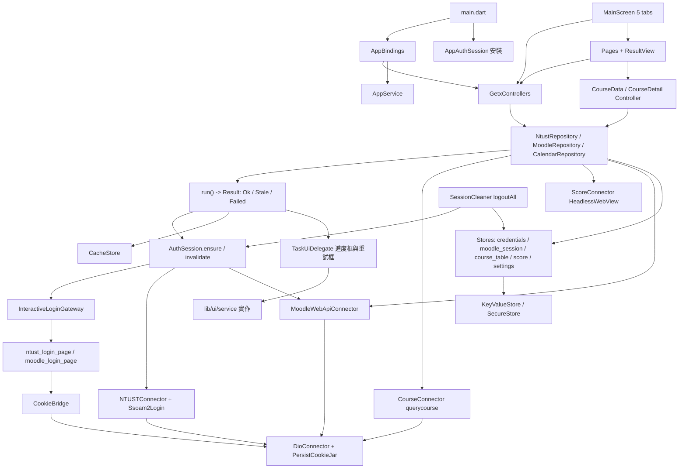

# TAT 架構地圖

> 臺灣科技大學校務 App（`club.ntust.tat`）的架構說明。
> 本文描述 repo 現況，所有路徑以 repo 根目錄為準。

## 這是什麼專案

TAT 把學校的單一登入、課程查詢、成績系統與 Moodle 包成一支 Flutter App，主畫面是
課表、資訊系統、行事曆、成績、其他五個分頁。導航、DI 與 Rx 狀態走 GetX。

| 項目 | 數值 |
| --- | --- |
| Flutter SDK | 3.38.5（鎖在 `.fvmrc`，fvm 與 Puro 都讀得到） |
| `lib/` Dart 檔案 | 273（其中 30 個 `*.g.dart`），import 邊 1054 |
| GetxController | 7，另有 1 個 GetxService（`AppService`） |
| 測試 | 1556 個，135 個測試檔 |
| analyzer | `dart analyze --fatal-infos` 零問題 |
| 外部系統 | 校內 6 台主機，校外 Firebase、GitHub API、Google Forms、Google Fonts、App Store / Google Play |
| CI | GitHub Actions 三個 job：`analyze-and-test`、`build-android`、`build-ios` |

## 分層

`tool/deps.py` 的 `RANK` 是分層的唯一定義：rank 越小越上層，`A → B` 而
`rank(B) < rank(A)` 就是上行邊。

| rank | 層 | 目錄 | 檔案 | 職責 |
| --- | --- | --- | --- | --- |
| 0 | main | `lib/main.dart` | 1 | 啟動順序：Firebase、Dio、Model、安裝 AuthSession 與登入閘道、決定初始路由 |
| 1 | ui | `lib/ui/` | 103 | 頁面、共用元件、兩個 WebView 登入頁、路由 |
| 2 | controller | `lib/src/controller/` | 17 | 頁面狀態；只回資料，不開對話框 |
| 2.5 | repository | `lib/src/repository/` | 7 | 取資料的唯一入口，對外只回 `Result<T>` |
| 3.5 | auth | `lib/src/auth/` | 3 | 登入狀態的唯一所有者 |
| 4 | connector | `lib/src/connector/` | 10 | 唯一的 HTTP 出口：單一 Dio 加持久化 cookie jar。唯一不是 form-urlencoded 的出口是 `DioConnector.postMultipart`（換頭貼的上傳） |
| 5 | util | `lib/src/util/`、`service/`、`file/`、`version/` | 44 | 靜態工具、GetxService、平台服務、下載、版本遷移與商店更新 |
| 6 | store | `lib/src/store/` | 9 | 本機持久化，不碰網路 |
| 7 | config | `lib/src/config/`、`R.dart`、`firebase_options.dart` | 9 | 純常數與多語系門面 |
| 8 | model | `lib/src/model/`、`lib/src/enum/` | 65 | json_serializable 模型 |
| 9 | generated | `lib/generated/`、`lib/l10n/` | 4 | Intl 產生物 |
| 10 | log | `lib/debug/` | 2 | 橫切關注點 |

兩個排序刻意不照直覺：

- **store 排在 util 之下**，所以 `LanguageUtils`、`AppService` 讀 store 是合法的向下邊。
- **log 排在最底下**，讓每一層都能記 log。這個特權是有條件的：`lib/debug/`
  必須是葉節點，`deps.py` 的 `check_log_is_a_leaf()` 每次檢查都會驗；哪天它
  import 了自己以外的專案檔案，CI 會直接失敗而不是安靜放行。

**命名分工**：`*_store.dart` 是持久化（寫進 SharedPreferences / Keychain /
Keystore），`*_repository.dart` 是取資料（登入需求、快取回退、重試）。兩邊同名
會逼所有同時用到的檔案加 import 前綴。

### 棘輪門檻（`python3 tool/deps.py --check`）

三個數字都只能降不能升，寫在 `tool/deps.py` 最上方：

| 指標 | 現值 | 門檻 |
| --- | --- | --- |
| 上行邊 | 0 | `MAX_UPWARD_EDGES = 0` |
| 跨層強連通分量中的非 UI 檔案 | 0 | `MAX_NON_UI_IN_CYCLE = 0` |
| 最大強連通分量 | 25 | `MAX_SCC = 25` |

`MAX_UPWARD_BY_PAIR` 是空的：出現任何一種新的上行邊配對都會失敗，不論多寡。
`lib/ui/` 內部的環是固有的（`route_utils` 與各頁面互相 import），不計入。

## 一次請求怎麼走

`lib/src/repository/run.dart` 的 `run<T>()` 是所有取資料路徑的共用外殼，
對外只回 `Result<T>`。

```dart
Future<Result<T>> run<T>({
  required Set<SystemId> requires,   // 需要哪些系統已登入
  required Future<T?> Function() fetch,  // 回 null 代表失敗
  Set<SystemId> optional,            // 盡力而為的登入，失敗不影響結果
  CacheKey<T>? cache,                // 離線快取
  bool cacheFirst,                   // 只給識別子對照表用
  String? progressMessage,           // 有值就開進度框
  String? errorMessage,
  RetryPolicy retry,                 // askUser（預設）或 none
  String debugLabel,
  bool background,                   // 不開進度框、不開登入頁
})
```

`Result<T>` 是 sealed 三態，不是一顆 bool：

- `Ok<T>` — 這次真的抓到新資料。
- `Stale<T>` — 沒抓到，但快取讀得回來，帶 `FailureReason`。畫面必須標示。
- `Failed<T>` — 沒抓到也沒快取。

`FailureReason` 決定 UI 畫什麼：`Offline`、`NotSignedIn`（不可重試，畫登入按鈕）、
`LoginFailed`、`FetchFailed`、`UnsupportedCourse`（不可重試）。在 `fetch` 內丟
`TaskFailure` 可以指定原因；丟一般例外時 `run()` 會依當下連線狀態重新分類成
`Offline` 或 `FetchFailed`。

`run()` 內部：

1. `cacheFirst` 且命中就直接回 `Ok`，完全不打網路。
2. 探測不到網路就走 fallback。
3. 進重試迴圈：`auth.ensure(requires, interactive: !background)`。登入失敗與取
   資料失敗共用同一個迴圈，因為使用者按的是同一顆按鈕。
4. `optional` 逐一 `tryEnsure`。
5. 開進度框（`background` 時不開），跑 `fetch()`，`finally` 收掉。handle 開在迴圈
   裡，每一輪都是自己的一個。
6. 有值就寫快取回 `Ok`；否則依 `retry` 與 `reason.retryable` 決定要不要問使用者。
   使用者按重試 → `auth.invalidate(requires)` 再跑一輪，這一行就是「按重試會靜默
   重新登入」的全部語意。放棄或不可重試 → 讀快取，有就 `Stale`，沒有就 `Failed`。

`run()` 的相依全部透過各自的 `instance` 靜態欄位取得。**不要改用 `Get.find`**：
那會讓 repository 層依賴 GetX 的服務定位，測試也得先起一個容器。

### 走一遍：載入課表

1. `AppBindings`（掛在 `GetMaterialApp.initialBinding`）以 `lazyPut(fenix: true)`
   註冊 `MainController`、`CourseController`、`CalendarController`、
   `ScorePageController`。**分頁的 controller 不在頁面的 `build()` 裡 `Get.put`**：
   `Get.put` 對已註冊的實例是 no-op，`onInit` 不會再跑，狀態會卡住。
2. `CourseController.onInit` → `_loadSetting()` 讀 `Model.getCourseSetting().info`。
   一般重啟時課表已在磁碟上，直接畫，不觸發任何網路。同時在 post-frame callback
   背景預載學期清單（`background: true`，不開進度框也不開登入頁）。
3. 真的要抓時 `CourseModel.getCourseTable()`：沒指定學期就先 `getSemesterList()`
   取第 0 個。
4. `NtustRepository.getCourseTable()` → `run(requires: {SystemId.ntustSso})`。
5. `AppAuthSession._ensureNtustSso`：`ssoReady` 為真就直接過；否則先跑
   `NTUSTConnector.login` 這一段非互動的。站台明確回了訊息（多半是帳密錯）就直接
   回錯，不再開登入頁多燒一次嘗試；其餘情形才升級成可見的 ssoam2 登入頁
   （`InteractiveLoginGateway`）。
6. `fetch` = `_fetchCourseTable`：`_courseIdsFor(semester)` 先讀成績快取拿課號，
   沒有才 best-effort 問 Moodle；再由 `CourseConnector` 打 querycourse 的公開
   API 逐門查回來。
7. 組成 `CourseTableJson`（`Day` × `SectionNumber` 的巢狀 map）。只有本人的課表
   才 `Model.addCourseTable` 寫進 `course_table_list`。
8. 回到 controller，`isLoading` 換狀態，頁面的 `Obx` 重畫。

## 登入

`lib/src/auth/`。

**`SystemId` 只有兩個成員，而且彼此零相依**：`ntustSso` 與 `moodleWebApi`。
`ensure` 因此不需要遞迴，也沒有相依展開。拿 wsToken 的過程會經過 ssoam2，但那是
登入頁的 WebView 自己完成的，不需要事先有 SSO session。

**成績系統刻意不是成員**：它底下零網路呼叫，`ScoreConnector` 的
HeadlessInAppWebView 靠的就是 SSO cookie，等同 `ntustSso`。多一個成員就多一顆會
被漏清的旗標，換帳號後 B 會看到 A 的成績；列舉裡沒有它，這個 bug 在型別上就不可
能發生。**選課系統也不是成員**：它沒有自己的憑證。

- `AuthSession`（介面）宣告 `ensure` / `tryEnsure` / `invalidate` / `isSignedIn`。
  `instance` 預設是會拋的 `UninstalledAuthSession`，忘記安裝會立刻炸在啟動路徑
  上，而不是靜靜當成「已經登入」。
- `AppAuthSession`（實作）是登入流程的唯一一份。`ensure` 是唯一發起登入的入口，
  `run()` 的 `requires` 是唯一宣告需求的方式。`inFlight` 是 process 級 static，
  沒有它冷啟動時課表與 Moodle 個人資料並行會各開一個登入頁。
- `AuthFailure` 刻意不是 repository 的 `FailureReason`：auth 是 repository 的
  相依，反過來 import 會是上行邊。對映在 `run()` 裡只有一行，而且要把站台自己回
  的訊息帶下去。
- `SessionCleaner`（住在 `auth/` 而不是 `service/`，因為它要呼叫
  `AuthSession.invalidate`）負責登出：wsToken、平台 WebView cookie、Dio cookie、
  `cache_` 快取、桌面小工具截圖，漏一項換帳號後 B 就會看到 A 的資料。

**Moodle token 過期**：connector 不自己重登（它會 `Get.to` 一個 WebView，背景任務
憑空彈登入頁比失敗本身更糟），只把錯誤從 `onApiError` 送出來，由
`AppAuthSession.onMoodleApiError` 清掉記憶體與磁碟上的 token，下一次 `ensure` 走
完整登入。**這個掛鉤一定要在啟動時裝上**，沒裝的話重試會帶著同一顆死 token 再失敗。

**兩套 cookie**：Dio 的 `PersistCookieJar` 與平台 WebView 的 store。**平台 WebView
store 是權威，Dio jar 是它的鏡像**——成績頁的 headless WebView 全檔沒有任何 cookie
API，而所有互動式登入本來就跑在 WebView 裡。`CookieBridge` 是唯一的橋樑。

## 持久化

`lib/src/store/`，九個檔案（八個 `*_store.dart` 加一個 `model.dart` 門面）。

| 檔案 | 內容 |
| --- | --- |
| `key_value_store.dart` | SharedPreferences 的抽象層。「讀出來、改一改、寫回去」**不是原子的**，需要原子性的呼叫端要自己排隊 |
| `secure_store.dart` | Keystore / Keychain 抽象。iOS 用 `first_unlock_this_device` |
| `credentials_store.dart` | 帳號、密碼、WebMail 密碼 |
| `moodle_session_store.dart` | wstoken 與 privateToken |
| `course_table_store.dart` | `course_table_list`；學期清單是純記憶體，不落地 |
| `score_store.dart` | `score_credit` |
| `settings_store.dart` | 使用者偏好 |
| `cache_store.dart` | `cache_` 前綴的離線快取，per-name 佇列擋無鎖覆寫 |
| `model.dart` | 啟動載入與 `logout()` 的門面 |

憑證與 Moodle token 存在 secure storage（Android Keystore / iOS Keychain），
其餘走 SharedPreferences。

`CredentialsLoadResult` 是三態（`loaded` / `absent` / `unavailable`）而不是
nullable：**「讀不到」不等於「沒登入」**。Android 從備份還原、iOS 在鎖定狀態下被
背景推播喚醒時 Keystore 暫時不可用，這時絕對不能清掉任何東西，也不能把使用者送回
登入畫面要求重打密碼。`main.dart` 的 `getInitialRoute` 對 `unavailable` 照樣進主
畫面。

## 外部系統

| 系統 | 存取方式 | 程式位置 |
| --- | --- | --- |
| NTUST SSO<br>`ssoam2.ntust.edu.tw` | 先跑一段非互動的填表登入（表單 markup 因路徑而異：根路徑用 `name="UserName"`，`/account/login` 用 `id="Username"`；想知道「現在登入了沒有」必須走根路徑）；需要真人過 Turnstile 時才升級到可見的登入頁 | `ssoam2_login.dart`<br>`ssoam2_headless_login.dart`<br>`ntust_login_page.dart` |
| 學生入口<br>`i.ntust.edu.tw` | Dio GET 加 package:html 爬子系統功能樹，需 SSO | `NTUSTConnector.getSubSystem` |
| 教務處行事曆<br>`www.academic.ntust.edu.tw` | 公開頁爬 `.ics` 連結後下載成 `calendar.ics`。這台主機少送一張中介憑證，由 `twca_intermediate.dart` 補上 | `NTUSTConnector.getCalendarUrl`<br>`calendar_repository.dart` |
| 課程查詢 API<br>`querycourse.ntust.edu.tw` | 公開 JSON API，**不需登入**：關鍵字搜尋、課程詳細、用課號反查課表 | `course_connector.dart` |
| 成績查詢系統<br>`stuinfosys.ntust.edu.tw` | 不走 Dio。HeadlessInAppWebView 載入頁面取 HTML 再解析 | `score_connector.dart` |
| Moodle<br>`moodle2.ntust.edu.tw` | WebView 走 `admin/tool/mobile/launch.php` 取 wstoken，之後 POST wsfunction：`core_webservice_get_site_info`、`core_enrol_get_users_courses`、`core_course_get_contents`、`core_enrol_get_enrolled_users`、`mod_forum_get_forum_discussions`、`gradereport_user_get_grade_items`、通知偏好兩支、`tool_mobile_get_autologin_key`（WebView 免登入）、`core_calendar_get_action_events_by_timesort`（行事曆頁的待辦）、`gradereport_overview_get_course_grades`（成績分頁的「Moodle 目前成績」：這學期每一門課的即時總分，只在使用者開那一頁時發——伺服器會先把所有課重算一次成績）、`mod_assign_get_assignments` 與 `mod_assign_get_submission_status`（課程頁「作業」分頁與作業詳情：截止日期、繳交狀態、成績與回饋）、`mod_assign_save_submission` 與 `mod_assign_submit_for_grading`（在 App 內交作業：檔案與線上文字；團隊／有時限／匿名評分的作業一律導網頁。這兩支回的是**裸的 warnings 陣列**，`treatWarningsAsError` 看不到）、`mod_quiz_get_quizzes_by_courses`、`mod_quiz_get_user_attempts`（Moodle 5.0 起改名 `mod_quiz_get_user_quiz_attempts`，依 site_info 的 `functions[]` 擇一）與 `mod_quiz_get_user_best_grade`（課程目錄點測驗進去的唯讀資訊頁：開放時間、作答時限與剩餘次數、最佳成績與作答紀錄；作答一律導到網頁）、`mod_forum_get_forums_by_courses`（用 `type == 'news'` 找公告區）與 `mod_forum_get_discussion_posts`（公告討論串的回覆）、討論區讀寫六支（`mod_forum_add_discussion_post` 回覆、`mod_forum_get_forum_access_information` 問能不能附檔、`mod_forum_get_discussion_post` 拿編輯要用的原文與新鮮能力、`mod_forum_prepare_draft_area_for_post` 編輯時保住既有附件與內嵌圖片（`area` 分別送 attachment／post）、`mod_forum_update_discussion_post` 編輯、`mod_forum_delete_post` 刪除；App 內只回覆、不開新主題，**發**的是純文字加附件；**編輯**既有貼文依原文的 messageformat 分流：純文字走文字框、FORMAT_HTML 走所見即所得編輯器（排版與內嵌圖片都留得住，但加不了新圖，官方 App 也一樣）、其他原始碼格式照原樣編輯。只有私訊回覆導到網頁）、站內通知五支（`message_popup_get_popup_notifications` 的清單、兩支未讀數與兩支標記已讀，三支的 `useridto` 不能送 0）、換頭貼與交作業共用的 `webservice/upload.php`（把檔案送進 draft 區換一個 itemid，再由 `core_user_update_picture` 套用或移除；前者不是 wsfunction，回的是 `text/plain`） | `moodle_webapi_connector.dart`<br>`moodle_login_page.dart` |
| Firebase<br>`projectId ntust-tat` | Crashlytics 接 `FlutterError` 與 `runZonedGuarded`；Analytics 掛 navigatorObservers；Remote Config 讀公告；FCM 轉本地通知 | `lib/src/util/*_utils.dart` |
| GitHub API | 貢獻者頁，`github` 套件 | `contributors_page.dart` |
| App Store / Google Play | 啟動時問商店有沒有新版：Android 走 Play 的 in-app update（Play 自己的下載提示），iOS 用 `upgrader` 查 App Store 後跳對話框。兩邊都可以按「稍後」，沒有強制更新 | `store_update.dart`<br>`update_prompt.dart` |
| Google Forms | 意見回饋的預填網址 | `AppLink.feedback` |
| Google Fonts | 執行期抓 Noto Sans TC | `app_themes.dart` |

WebMail（`mail.ntust.edu.tw`）與舊版 SSO 頁（`ssoam.ntust.edu.tw/nidp/app/login`）
只在通用 WebView 頁裡出現，後者是自動填帳密的判斷依據。

另有兩個 Android MethodChannel：`club.ntust.tat.widget`（桌面課表小工具）與
`club.ntust.tat.save`（SAF 資料夾選擇）。

**學期清單的三個事實**（`NtustRepository.getSemesterList` 的註解是權威版本）：

- `ScoreConnector.getScoreRank()` 回答「**這位學生修過哪些學期**」——有修課才有
  成績。**這是唯一能回答這件事的來源**，拿不到時退回硬碟上那一份。
- `MoodleWebApiConnector.getCurrentSemester()` 補當前學期，成績系統只知道已經有
  成績的學期。
- `querycourse/api/semestersinfo` 看起來是完美替代品，但它免憑證，回的是「系統有
  哪些學期」而不是「這位學生有哪些」。

清單只剩一個學期時，唯一要問的是「哪個來源沒答」，`[semester-list]` 那行 log 就是
答案。

## UI 慣例

- 樣板是 **controller 持一個 `Rxn<Result<T>>`（null 代表載入中），頁面用
  `ResultView` 畫出來，`build()` 不觸發任何請求**。`Stale` 會在內容上方多一條
  橫幅，使用者才知道自己看的是舊資料。
- `ResultView` 的錯誤畫面由呼叫端注入而不是直接用 `ErrorPage`：`error_page.dart`
  import `route_utils.dart`，而後者 import 所有頁面。
- **controller 不可以持有 Widget、不可以開對話框**，那是 controller → ui 的上行
  邊。要跳對話框走 `TaskUiDelegate`；要開登入頁走 `InteractiveLoginGateway`。
  兩個介面都在 `lib/src/service/`，實作在 `lib/ui/`。
- 課程資料頁與課程詳情頁的分頁狀態是普通類別（`CourseDataController`、
  `CourseDetailController`），不是 GetxController：生命週期就是那一個頁面。它們在
  進入頁面時就把分頁的請求一起發出去，因為 `PageView(children:)` 是懶載入的。
  作業詳情頁、測驗詳情頁、公告討論串頁與公告與通知頁同理
  （`CourseAssignmentController`、`CourseQuizController`、
  `CourseAnnouncementController`、`AnnouncementCenterController`）。交作業的
  編輯頁也是（`CourseAssignSubmitController`）：作業與繳交狀態是值傳進去的，
  那一頁不做 `ResultView`。
- 寫入路徑（換頭貼、標記已讀、切換通知設定、交作業）一律 `treatWarningsAsError: true`：
  `warnings[]` 有一筆就代表那次寫入沒有發生，絕對不可以回報成功，畫面也不可以停在
  樂觀狀態。`mod_assign_save_submission` 與 `mod_assign_submit_for_grading` 是例外
  中的例外——它們回的是**裸陣列**，共用的 `moodleErrorOf` 看不到，所以另有
  `MoodleWebApiConnector.writeWarningOf`。交作業成功與否都會重抓一次
  `mod_assign_get_submission_status` 並寫回同一把快取鍵，使用者看到的是伺服器的
  真相而不是 App 的推測。
- 新頁面**不可以** import `route_utils.dart` / `error_page.dart` / `base_page.dart`
  （lib/ui 那個環已經卡在 `MAX_SCC` 的門檻上）：錯誤畫面與 WebView 開啟器由
  在環裡的呼叫端注入，公告分頁、討論串頁（`CourseForumThreadPage`，公告與一般討論區共用）、討論區主題清單頁（`CourseForumPage`）、發文頁（`CourseForumComposePage`，送出的動作由呼叫端以 closure 注入，所以它連 repository 都不碰）、作業分頁、作業詳情頁、測驗詳情頁、公告與通知頁與「Moodle 目前成績」頁就是這樣接的（公告與通知頁的兩半、以及「Moodle 目前成績」的清單都是頁面中段的區塊，所以它們只注入開啟器／導頁，錯誤畫面一律 `InlineErrorView`）。嵌在頁面中段、周圍
  畫面還在的區塊（行事曆的待辦、作業詳情的狀態卡）失敗時用 `InlineErrorView`
  （`lib/ui/components/page/`，不在環裡）：它有就地重試的鈕，`ErrorPage` 沒有。
  同一批區塊「空」的時候用 `SectionEmptyState`（同一個目錄）而不是整頁級的
  `EmptyState`：後者的插圖大一號，同一頁疊兩份會像兩個空畫面。
  這段規則的檔案內註解只留一句指到這裡，不要再各自抄一份。資訊系統頁、個人資訊頁
  與修課學生名單頁也是這樣接的：三者的導頁、錯誤畫面與 WebView 開啟器統一在
  `route_utils.dart` 的 `toSubSystemPage` / `toProfilePage` / `toCourseMemberPage`
  注入。修課學生名單的 controller 由課程詳情頁持有並負責 dispose，路由那一層只
  轉交——那支 Moodle API 很慢，返回再進去必須直接畫上一次的結果。
- 主畫面**四個分頁**（課表 / 行事曆 / 成績 / 更多）的順序必須與 `MainTab` 一致
  ——導覽列與 Analytics 事件都靠索引對應。`MainTab` 的名稱會直接送進 Analytics
  當 screen name，所以拿掉一個分頁時是**刪掉那個值**而不是改名，其餘的拼法才
  不會跟著位移。資訊系統就是這樣從導覽列搬進「更多」的：`MainTab.subSystem`
  被刪掉，`SubSystemPage` 改由 `AnalyticsUtils.observer` 以路由名記錄。
- 選取／未選取的導覽列圖示顏色與尺寸一律由 `AppStyles.navigationBarTheme` 決定，
  `NavigationDestination` 裡不要再塗一次。`items` 必須是 getter：欄位只在 State
  建立時初始化，而語系切換只重跑 `build()`，標籤會永遠停在啟動時的語言。
- 圖示一律用 `lib/ui/other/lucide_icons.dart` 的常數，不用 Material 的 `Icons.`。
  三個類別是三種筆畫粗細、碼位相同只差 fontFamily：內文與清單用預設的
  `LucideIcons`（1.5px），要更細（例如和 `FileTypeIcon` 那批 1px 的檔案類型圖示
  並排）用 `LucideIconsThin`，要強調用 `LucideIconsThick`（2.0px）。這個檔案是
  **產生**的：先寫呼叫點，再跑 `python3 tool/gen_lucide_icons.py`（`--check` 是
  CI 的漂移檢查，`--list <name>` 查碼位）。不要手改，也不要在 runtime 組
  `IconData`——那會讓 tree shaking 失效。合併衝突時取任一邊再重跑產生器。
- 語系切換靠改 `Intl.defaultLocale`，`GetMaterialApp` 沒設 `locale`；主題以
  `Get.changeThemeMode` 加 `Get.forceAppUpdate` 生效。

## 目錄導覽

| 路徑 | 內容 |
| --- | --- |
| `lib/main.dart` | 啟動順序。`AuthSession` 與 `InteractiveLoginGateway` 必須在 `runApp` 之前安裝，不能放 `onReady` |
| `lib/src/repository/` | `run.dart`、`result.dart`、`retry.dart` 加四個 repository（ntust / moodle / calendar / app_notice；最後一個把 Remote Config 的 App 公告也套進 `Result`，公告與通知頁兩半才共用同一個 `ResultView`） |
| `lib/src/auth/` | `auth_session.dart`（介面與 `SystemId`）、`app_auth_session.dart`、`session_cleaner.dart` |
| `lib/src/store/` | 九個持久化檔案 |
| `lib/src/connector/` | `core/` 放 DioConnector 與門面；站台 connector 在根目錄；`interceptors/` 放 Referer 與遮蔽版 log |
| `lib/src/controller/` | `app_binding.dart` 加各頁 controller；課表另有 `course_model.dart` |
| `lib/src/service/` | AppService、ThemeService、`TaskUiDelegate` / `InteractiveLoginGateway` 介面、ssoam2 登入、cookie 橋、小工具服務、連線探針 |
| `lib/src/model/` | json_serializable 模型。`TablesEntity` 刻意手寫 `fromJson`：Moodle 的 `tabledata` 元素有時是空陣列（代表分隔線），產生器會拋型別錯誤 |
| `lib/src/util/` · `version/` · `file/` | 靜態工具、版本遷移（`app_version.dart`）與商店更新（`store_update.dart`）、下載目錄。`file_icon_utils.dart` 依檔名 / MIME / modicon 挑 Moodle 檔案類型 icon，查的表 `file_icon_table.dart` 由 `tool/gen_file_icon_table.py` 從官方 App 的資料產生，不要手改 |
| `lib/ui/screen/` | MainScreen、LoginScreen、PrivacyPolicyScreen |
| `lib/ui/pages/` | 四個分頁與其子頁、資訊系統頁（`subsystem/`，從導覽列搬進「更多」）、個人資訊頁（`other/page/profile_page.dart`，唯讀，只有頭貼可改）、修課學生名單頁（`course_member/`，從課程詳情的分頁獨立出來）、通用 WebView、log 檢視頁 |
| `lib/ui/components/` | BasePage、ErrorPage、LoadingPage、`ResultView`、`EmptyState` / `SectionEmptyState`、AppBar、tile、shimmer、`FileTypeIcon`（畫 `assets/image/files/*.svg`，那 29 個單色 SVG 來自 moodlehq/moodleapp，Apache-2.0） |
| `lib/ui/auth/` | 兩個 WebView 登入頁與 `InteractiveLoginGateway` 實作 |
| `lib/ui/routes/route_utils.dart` | 所有導頁集中在這裡 |
| `lib/debug/log/` | Log 門面，必須是葉節點 |
| `tool/deps.py` | 分層度量與棘輪 |
| `android/.../MainActivity.kt` · `java/widget/` | 兩個 MethodChannel 與桌面課表小工具 |

## 建置

```bash
flutter pub get --enforce-lockfile   # 安裝依賴，並確認 pubspec.lock 未被更動
dart analyze --fatal-infos           # 零 error / warning / info
flutter test                         # 1304 個測試
python3 tool/deps.py                 # 分層與匯入環度量
python3 tool/deps.py --check         # CI 模式，超過棘輪門檻時失敗
```

Firebase 設定檔不在版控，建置前需自行放置 `android/app/google-services.json` 與
`ios/Runner/GoogleService-Info.plist`。**在 git worktree 內開發時這兩個檔案不會
被帶過去**（worktree 只取得被追蹤的檔案），要從主 checkout 手動複製。
`pub get` / `analyze` / `test` 都不需要它們。

**Android release 由 R8 壓縮與混淆。** `minifyEnabled` 與 `shrinkResources` 由
Flutter 自己的 Gradle plugin 設成 true，`android/app/build.gradle` 刻意不再寫——
寫了會因為 `buildTypes` 跑得比 `plugins` 晚而把它蓋回去。`proguard-rules.pro`
只留三組必要的 keep：

- `com.dexterous.flutterlocalnotifications.models.**` — 排程通知以 gson 依欄位名
  序列化進 SharedPreferences，欄位名被混淆之後重開機或跳到排定時間會反序列化成
  一堆 null。這個外掛沒有自帶 consumer 規則。
- `-keepattributes Signature` 與 `*Annotation*` — 靠反射看型別的序列化需要它們
  還原泛型。
- `-keepattributes SourceFile,LineNumberTable` 與 `-renamesourcefileattribute` —
  沒有的話 Crashlytics 上 Java/Kotlin 的堆疊沒有檔名也沒有行號。

**不需要寫任何 `io.flutter.**` 的 blanket keep**：AGP 從合併後的 manifest 產生的
`aapt_rules.txt`、Flutter plugin 掛的 `flutter_proguard_rules.pro` 與
`proguard-android-optimize.txt` 已經蓋住。要驗證就跑一次 release 建置後讀
`build/app/outputs/mapping/release/` 底下的 `configuration.txt`（R8 真正吃進去的
規則）與 `seeds.txt`（真正被保留的項目）。

Android lint 以 `lint-baseline.xml` 當棘輪：既有問題記錄在案，新問題會讓建置失敗。

**沒有任何內建字體**：`google_fonts` 在執行期抓 Noto Sans TC。選它是因為它是唯一
字形完整、不會缺字的選項。

## 依賴關係圖



實線都是向下邊；`tool/deps.py` 現在量到零條上行邊。

---

## 不可以改的東西

### 持久化格式不可以在沒有資料遷移的情況下變更

專案曾因此丟過一次使用者資料。

- **`Day` 與 `SectionNumber` 的 enum 名稱就是課表 JSON 的 map key。** 改名或加上
  不一致的 `@JsonValue` 會讓解碼失敗，而 `Model.getInstance` 的搶救路徑會把整張
  課表清空，連帶清掉整個 setting blob。守門測試：
  `test/model/course_table_json_test.dart`、
  `test/model/persisted_json_roundtrip_test.dart`。
- 同一份測試凍結了每個持久化型別「編碼後最上層的 key 名稱」。任何欄位改名都會在
  CI 直接紅燈——那是刻意的，不要為了讓測試過而改測試。
- `SettingsStore` 的所有 key 名同理，改名會讓已安裝的使用者升級後設定消失。
- `course_table_list` 是一個 StringList，每個元素各自是一份 `CourseTableJson`
  的 JSON，不是一整包 JSON 陣列。
- 移除持久化欄位時，升版與降版兩個方向都要補斷言。

### 快取解碼失敗要移除該筆，不要只吞例外

已安裝裝置上的舊 blob 是舊格式，新的 decoder 會拋。解碼失敗時必須把該筆移除，
否則每次進入該頁都會重讀重丟。

### cookie 網域必須留在 `.ntust.edu.tw`

ssoam2、stuinfosys、i.ntust 是不同 host，只有網域 cookie 能跨。改成逐 host 會
**靜默**弄壞成績頁：`ScoreConnector` 拿不到 cookie 只會回 null，使用者看到的是
通用錯誤訊息。

### `cache_` 前綴

登出是用這個前綴掃出所有快取來清除的。命名不符的 key 會在登出後殘留，
`CacheKey` 的建構子有 assert 擋。

### 成績快取不只成績頁在用

課表的歷史學期是靠 `score_store` 裡的課號反查課程查詢 API 的。
「取學期清單時順便存成績」那個看起來突兀的副作用不能拿掉。

### 不要再引入另一套狀態管理

七個 controller 都是 GetX。再加 riverpod 或 bloc 只會更亂。

---

## 已接受的風險

維護者看過並決定不處理。列在這裡是為了避免日後被當成新發現重新調查一次。

- **`android/key.properties` 的 keystore 密碼在公開 repo 的 git 歷史裡**
  （自第一個 commit）。`.jks` 本身不在版控，所以光有 repo 簽不出 APK。若日後改變
  主意，處理方式是輪替 keystore 密碼（`keytool -storepasswd` / `-keypasswd`）並把
  檔案改為不追蹤；改寫歷史對已經 fork 出去的副本無效。
- **`android:usesCleartextTraffic="true"`**，沒有 network_security_config。
  iOS 那邊的對應是 `NSAllowsArbitraryLoadsInWebContent`（只放行 WebView 內容），
  見 `ios/Runner/Info.plist` 的註解與 `test/ios/ats_info_plist_test.dart`。
- **意見回饋頁一打開就把錯誤 log 送進 Google Forms 的預填網址**，使用者還沒按
  送出，而隱私政策沒有揭露這件事（`other_page.dart` → `AppLink.feedback`）。
  意見回饋的做法本來就打算另外調整，屆時一起解掉。**在那之前這仍然是一個未揭露
  的資料外送**，不是已解決。
- **帳密存進 secure storage 之後，換手機從備份還原需要重新登入一次。**
  secure storage 的內容綁定裝置金鑰，還原到新裝置解不開。這是刻意接受的取捨，
  見 `lib/src/store/credentials_store.dart` 的類別註解。
- **換頭貼的入口一律顯示，可用與否等伺服器回答。** `core_user_update_picture`
  在 `!$userauth->can_edit_profile() || $userauth->edit_profile_url()` 時回
  `noprofileedit`，而 NTUST 的 Moodle 帳號很可能綁在 ssoam2 的 auth plugin 上。
  site_info 沒有任何欄位報得出這件事（`usercanmanageownfiles` 是私人檔案區、
  不是 `moodle/user:editownprofile`），要事先知道只能多打一趟探測。
  取捨是：入口照常給，失敗時用 `avatarProfileLocked` 明講「請到 Moodle 網站改」。
  若日後確認站台永久拒絕，再改成用一次性探測把入口收起來。

---

## 會咬人的地方

- **爬蟲靠固定索引與中文字串。** 成績列以 JSON map 長度判別型別，版面一改就被
  catch 成 null，最終只看到一個錯誤對話框，不易定位。Moodle 公告已改成用
  `mod_forum_get_forums_by_courses` 的 `type == 'news'` 找公告區，
  「一般」「公告」「課程公佈欄」的名稱比對只剩站台沒開那支 function 時的退路。
- **不要加回「抓選課系統課表網頁」那條路，也不要把 `SemesterJson.urlPath` 加回來。**
  兩者都已移除。App 對 `courseselection.ntust.edu.tw` 的每一次請求都停在 ssoam2 的
  登入表單——OIDC 交握用的是 form_post，跟 302 跟不到——所以那條路從來沒拿到過
  資料。而 `urlPath` 會跟著課表存進 SharedPreferences，一旦存在就會把舊資料導進
  一個為舊版 HTML 寫死索引的解析器。要救回選課系統，先做的是完成 OIDC 交握，
  不是修爬蟲。
- **`ScoreConnector` 的 headless WebView 必須只在真的走到成績頁時才收網。**
  `onLoadStop` 在轉址鏈的每一站都會觸發，SSO 的轉址頁剛好會解析出一份非 null 的
  空成績，呼叫端當成功寫回硬碟，成績頁就被清空且沒有任何錯誤訊息。20 秒逾時、
  `isCompleted` 檢查、`finally` 的 dispose 三件事都不能拿掉。
- **`dio` 的 `validateStatus` 放行到 500**，4xx 與 500 不會拋錯。行事曆因此要先寫
  暫存檔、驗過 `BEGIN:VCALENDAR` 才覆蓋正式檔，否則登入頁的 body 會被寫成
  `calendar.ics` 永久留在磁碟上。
- **關進度框要關 `beginProgress` 給的 handle**，不是全域的 hide——後者底下是
  `BotToast.cleanAll()`，會把並行分頁的遮罩一起收掉。
- **`CacheKey.decode` 必填。** 出貨指令帶 `--obfuscate`，型別名會被改寫，靠
  `T.toString()` 查表在 release 版永遠比對不中。
- **`background: true` 不等於 `retry: none`。** 後者只擋掉重試與錯誤對話框，擋不掉
  互動式登入——那個升級發生在 `ensure()` 裡面，而 `run()` 在看 `retry` 之前就已經
  呼叫過它了。背景預載少了這個旗標會在 SSO 過期時把登入頁蓋在使用者正在看的畫面上。
- **`R.current` 是 `S.of(Get.context!)` 的 lazy static**，navigator 還沒建好時直接
  拋。啟動路徑上碰到它的程式要放進 post-frame callback。
- **上傳不能走 `getDataByPostResponse`。** `BaseOptions.sendTimeout` 是 5 秒，而
  `IOHttpClientAdapter` 把它套在「送完整個 body」上而不是 chunk 間隔，一張照片
  在校園 4G 上必爆，錯誤還會被分類成一句沒有線索的「更換頭貼失敗」。
  `postMultipart` 是為此存在的第二條出口：自己的 sendTimeout、自己的
  `onSendProgress`，其餘路徑一行都不動。
